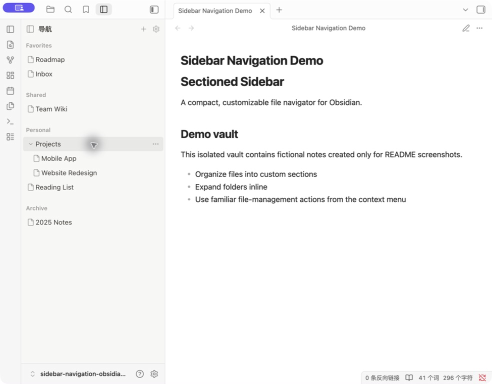
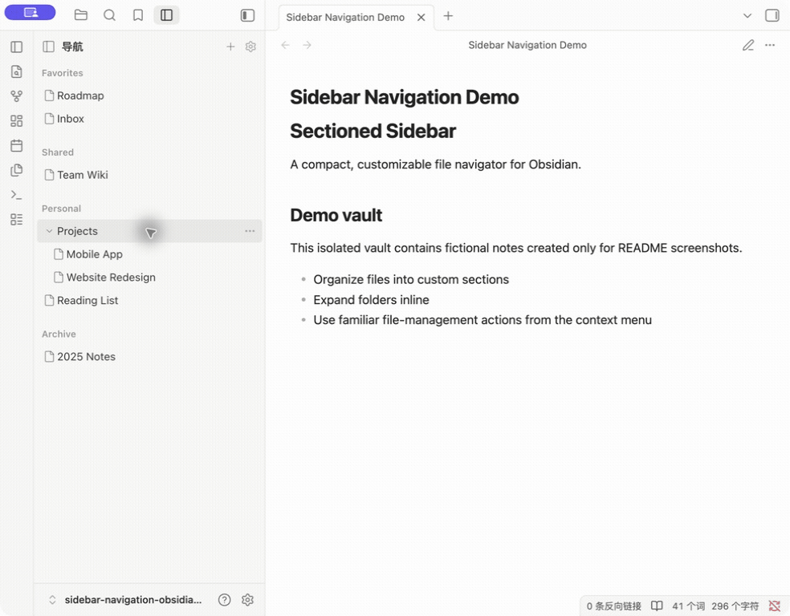

# Sectioned Sidebar

A customizable Obsidian sidebar that organizes real vault files and folders under virtual top-level sections.



## Interaction demo



Captured from the real Obsidian interface in an isolated demo vault containing only fictional sections, folders, and notes. No personal vault content is shown.

## Features

- Create, rename, reorder, collapse, and remove virtual sidebar sections.
- Follow Obsidian's interface language or switch the plugin manually between Simplified Chinese and English.
- Pin existing notes and folders without changing their real vault paths.
- Expand ordinary folders and browse their descendants in place.
- Show complete file names, including their extensions.
- Reuse Obsidian's file-menu extension system for familiar file and folder actions.
- Keep navigation-specific actions in a separate **Navigation management** submenu.
- Follow Obsidian rename events so pinned paths remain valid.
- Remove matching navigation references when a real note or folder is deleted.

## Install

1. Copy this repository into your vault as `.obsidian/plugins/sectioned-sidebar/`.
2. In Obsidian, open **Settings → Community plugins**.
3. Enable **Sectioned Sidebar**.

The plugin ID is `sectioned-sidebar`. If you tested an earlier pre-release build under `.obsidian/plugins/notion-navigation/` or `.obsidian/plugins/sidebar-navigation/`, rename that folder to `sectioned-sidebar` while Obsidian is closed. Keep `data.json` in the renamed folder to preserve your navigation settings.

Under **Settings → Sectioned Sidebar → Language**, choose **Follow Obsidian**, **简体中文**, or **English**. Changing the interface language does not rename existing custom sections.

## Data model

Sections and pinned paths are stored in the plugin's `data.json`. Reordering, moving between sections, expanding, collapsing, or removing a navigation item changes only that configuration. Real files are modified only when you choose an explicit file-management action.

## Development

The plugin is distributed as plain JavaScript and CSS; no build step is required.

```bash
node --check main.js
```

## License

[MIT](LICENSE) © 2026 blank247d
